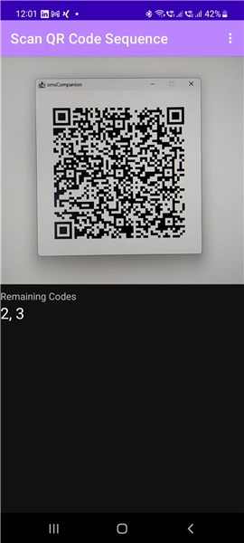
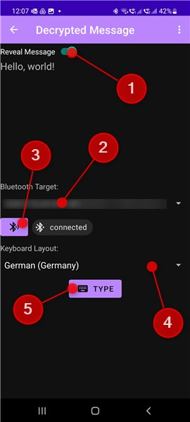

# OneMoreSecret

OneMoreSecret is an additional security layer for your data (e.g. passwords). It leverages the Android Keystore system turning your phone into a [hardware security module](https://en.wikipedia.org/wiki/Hardware_security_module). In other words: there is no master password any more, you access all your secrets with your phone and your fingerprint. 

### Disclaimer
This is a very early version of the software. Use it at your own risk. We'll try to keep the storage formats unchanged and guarantee the backward compatibility. 

## What's wrong with password managers?
In the early days, the computers were not password protected. The first password [dates back](https://www.smh.com.au/national/scientist-who-introduced-the-computer-password-20190717-p527zf.html) to 1961. As things got worse, [password policies](https://en.wikipedia.org/wiki/Password_policy) were born, together with the recommendation to have separate passwords for every application. This is how the [password manager](https://en.wikipedia.org/wiki/Password_manager) was born - as a workaround for the password policy. 

Don't get me wrong, [KeePass](https://keepass.info/download.html) and others have been doing a great job. But here are some concerns:

1. A security software with millions of installations is very attractive to hackers.
2. The guys know what to look for (e.g. password databases have a file type).
3. If you have the master password, you have access to the entire database. Not only you get a list of passwords, you also know where to log in - a typical password manager stores everything in one place. If you are extraordinary "smart", you can also store your [One Time Tokens](https://en.wikipedia.org/wiki/One-time_password) configuration in your password manager, thus bypassing the very idea of the [Multi-Factor Authentication](https://en.wikipedia.org/wiki/Multi-factor_authentication).
4. Even if there are some additional security measures to protect the password database (e.g. entering your password using Windows secure screen or protecting the database with the password and a key provider), they are often not active in the default configuration of your tool.
5. If you have access to a cloud password storage, you can collect milliond of password **databases**!

My personal nightmare is a hidden code change in a password manager making it send the data to a third party. And yes, the code changes to a cloud software apply for all customers at the same minute they are deployed... 💣

## What can OneMoreSecret do for you?
### No master password
👉 The encryption used in OneMoreSecret is based on keys, not data. Yes, it's the old good [asymmetric cryptography](https://en.wikipedia.org/wiki/Public-key_cryptography) wrapped into a handy tool. 

### No context
👉 Every password is stored separately. And every password is sent to the phone for decryption separately. So even if you steal a password, you will have to figure out, what it is good for. 

### Store it your way
👉 It's your ~~problem~~ choice how to store your credentials. You could use a text file with the service name, user name and the encrypted password. You could also use Excel or Google Keep. You could also conitnue using your KeePass (it has a very convenient user interface after all ❤️) and put your encrypted password into the password field. If your database is gone, you still have to decrypt every password separately.

### Key is not exposed
👉 The Android Keystore system does not "hand over" the key to the app. Once the key has been imported into the storage, you cannot extract it from the phone any more. 

## How it works
The data you want to decrypt gets into your phone by means of a QR code. So on your desktop, a window will pop up:

If we need more than one code, there will be a fast changing sequence of codes in this window, so that it takes maybe a second to transfer all the data. In our example, there will be three of them.  

The app will then ask you to scan your finger, use it to access your key and decrypt the message. Now you can either make your password visible by using the slider "Reveal Message" (1) or you just tell the app to type the password back to your PC (5). See the next chapter for details. 

## Setting things up
You will need omsCompanion - the companion app for your desktop. omsCompanion will generate a private key for you and transfer it to your phone. You will also use it to encrypt your secrets with the public key and to send the encrypted data to your phone. 

On your Android smartphone, you will need to set up the fingerprint authentification from your system settings. 

### Setting up Bluetooth
Once in the "Decrypted Message" screen, you can make your phone visible to other bluetooth devices (3) and connect from there (e.g. linking to your phone from your Windows PC. It will be registered as a keyboard). Select the target (2), make sure you have the correct keyboard layout (4) and press (5).

### On Keyboard Layouts
Long story short: select the keyboard layout that matches that of your target PC. 

A keyboard is not aware of the layout. If you press ";" on the US keyboard, there is a key code behind it: 51. Depending on the keyboard layout, your PC will make out of it: 
- ";" for English keyboard layout
- "ö" for German keyboard layout
- "ж" for Russian keyboard layout

...or the other way: if I wanted ";" to be typed from the German layout, I would send SHIFT + key code 54 instead. 