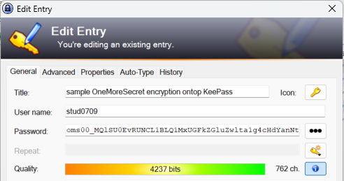
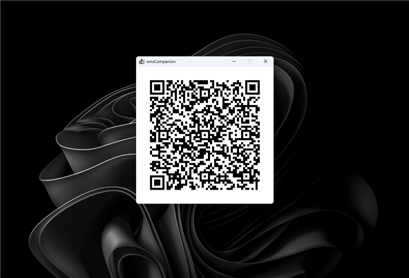
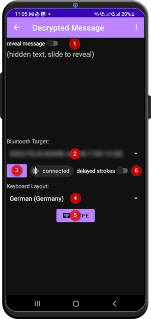
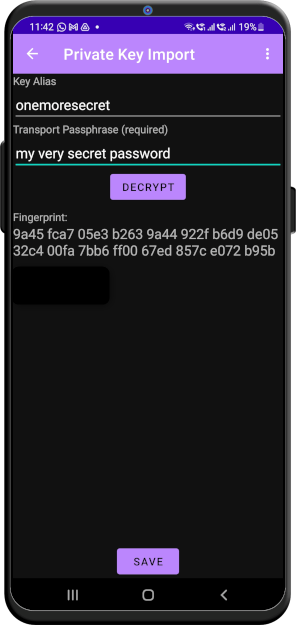

#  OneMoreSecret

OneMoreSecret is an additional security layer for your data (e.g. passwords). It leverages the Android Keystore system turning your phone into a [hardware security module](https://en.wikipedia.org/wiki/Hardware_security_module). In other words: there is no master password any more, you access all your secrets with your phone and your fingerprint. 

### Disclaimer
This is a very early version of the software. Use it at your own risk. We'll do our best to keep the message formats unchanged and guarantee the backward compatibility. 

## What's wrong with password managers?
In the early days, the computers were not password protected. The first password [dates back](https://www.smh.com.au/national/scientist-who-introduced-the-computer-password-20190717-p527zf.html) to 1961. As things got worse, [password policies](https://en.wikipedia.org/wiki/Password_policy) were born, together with the recommendation to have separate passwords for every application. This is how the [password manager](https://en.wikipedia.org/wiki/Password_manager) was born - as a workaround for the password policy. You *kind of* have different passwords for every service, and still there is only one password.

Don't get me wrong, [KeePass](https://keepass.info/download.html) and others have been doing a great job. But here are some concerns:

1. A security software with millions of installations is very attractive to hackers.
2. If you know the master password, you have access to the entire database. Not only you get a list of passwords, you also know where to log in - a typical password manager stores everything in one place. If you are extraordinary "smart", you will also store your [One Time Tokens](https://en.wikipedia.org/wiki/One-time_password) configuration in your password manager, thus bypassing the very idea of the [Multi-Factor Authentication](https://en.wikipedia.org/wiki/Multi-factor_authentication).
3. Even if there are some additional security measures to protect the password database (e.g. entering your password using Windows secure screen or protecting the database with the password and a key provider), they are often not active in the default configuration of your tool. 
4. If you have access to a cloud password storage, you can collect literally millions of password **databases**!

My personal nightmare is a hidden code change in a password manager making it send the data to a third party. And yes, the code changes to a cloud software apply for all customers in the same minute they are deployed... 💣

## Why OneMoreSecret?
...well, I am probably not the only one wondering if we are really better off with password managers or just storing all our credentials in one place for someone to come and collect them all at once. Maybe not today, but tomorrow...

If there is a vulnerability, there will be also an exploit for it. And it will work for a typical configuration. It is a good idea to be among those 1% with a setup, where the exploit will not work. 

...and I am fed up of typing my master password 40 times a day! 🤬

So here is the wish list I tried to implement with OneMoreSecret:

### No Master Password
👉 The encryption used in OneMoreSecret is based on keys, not a password phrase. Yes, it's the old good [asymmetric cryptography](https://en.wikipedia.org/wiki/Public-key_cryptography) wrapped into a handy tool. 

### No Context
👉 Every password is stored separately in its own encrypted envelope. And every password is sent to the phone for decryption separately and without context. So even if someone steals one password, he will still have to figure out, what it is good for. 

### Store It Your Way
👉 It's your ~~problem~~ choice how to store your credentials. You could use a text file with the service name, user name and the encrypted password. You could use Excel, or Google Keep, or GitHub Gists. You could also conitnue using your KeePass (it has a very convenient user interface after all ❤️) and put your encrypted password into the password field: 

If your database is stolen, the guys will still end up with decrypted password. Just remember to backup your password storage regularly. 

Personally, I prefer to store my KeePass database in the cloud storage. The file is encrypted, synced between your devices and protected from data loss.

### No Private Key Exposure 
👉 The Android Keystore system does not "hand over" the key to the app. Once the key has been imported into the storage, you cannot extract it from the phone any more. 

👉 The only way to restore your private key is the backup file (or paper document) together with the transport password. **DO NOT** share this document and password with others as this will grant access to all data encrypted by this private key. 

## How It Works
The data you want to decrypt gets into your phone by means of a QR code. So on your desktop, a window will pop up:

If we need more than one code, there will be a fast changing sequence of codes in this window, so that it takes maybe a second to transfer all the data. In our example, there will be three of them.  

The app will then reques the key from Android Keystore system. Android will ask you to scan your fingerprint, verify it and decrypt the message on behalf of the app ([here](https://developer.android.com/training/articles/keystore) are some technical details). Now you can either make your password visible by using the slider *reveal message* (1) or you just tell the app to type the password back to your PC (5). See the next chapter for details. 

## Setting things up
You will need [omsCompanion](https://github.com/stud0709/oms_companion) - the companion app for your desktop. *omsCompanion* will generate a private key for you and transfer it to your phone. You will also use it to encrypt your secrets with the public key and to send the encrypted data to your phone. 

On your Android smartphone, you will need to set up the fingerprint authentification from your system settings. 

### Importing the private key
*omsCompanion* will generate a private key for you. To import the key into your phone, you can use either the QR pop-up window from the *Cryptography -> New Private Key* wizard, or you can scan the codes from the backup document one by one. 

You can change the key alias if there is a conflict with other keys.

Enter your transport password, click *DECRYPT* and then *SAVE*. 

### Setting up Bluetooth
Once in the *Decrypted Message* screen, you can make your phone visible to other bluetooth devices (3) and connect from there (e.g. linking to your phone from your Windows PC. It will be registered as a keyboard). Select the target (2), make sure you have the correct keyboard layout (4) and press (5). If the the strokes are generated too fast for the target system (this is mostly the case if you are typing into Remote Desktop session), it can result in wrong entry. Please activate *delayed strokes* (6) in this case.

### On Keyboard Layouts
Long story short: select the keyboard layout (4) that matches that of your target PC. 

A keyboard is not aware of the layout. If you press ";" on the US keyboard, there is a key code behind it: 51. Depending on the keyboard layout, your PC will make out of it: 
- ";" for English keyboard layout
- "ö" for German keyboard layout
- "ж" for Russian keyboard layout

...or the other way: if I wanted ";" to be typed from the German layout, I would send SHIFT + key code 54 instead. 

## Roadmap
This software is being developed by one person, the amount of effort I can put into it is therefore limited. Please open a github issue if you have a feature request. 

## Credits
[android png from pngtree.com](https://pngtree.com/so/android)