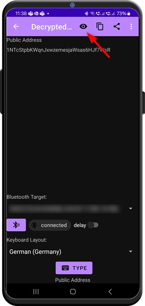

# Crypto Address

This is a viewer for you Bitcoin address. It will always display your public address. Your private key can be *auto-typed* in [WIF](https://en.bitcoin.it/wiki/Wallet_import_format) format if you switch the visibility icon.

