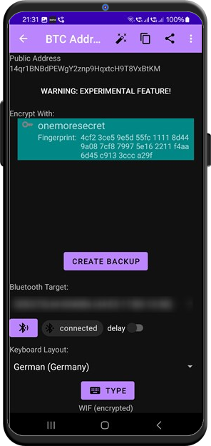

# Crypto Address Generator

Personally, I am not into crypto currency, but nevertheless, it is a fascinating piece of technology (and human frenzy). Resembles the [Tulip Mania](https://en.wikipedia.org/wiki/Tulip_mania) in a way, but as long as everybody agrees on the value...

Anyway: if you need a Bitcoin Cold Wallet, you can now use *OneMoreSecret* for that. It will generate a Bitcoin key pair and protect the private key in the same manner as all other secrets, so you will need your mobile phone to [access](./crypto_address.md) it again. 

Apart from that, you can also generate a backup file, ~~print it out and dig it in your garden~~.

Before you ask: **NO, *OneMoreSecret* is not a crypto wallet**, it does not store your crypto currency keys on the device. 

⚠️ **WARNING**: This is an experimental feature. I have tested it as thorough as I could, and still it comes **WITHOUT ANY WARRANTY**. 

If you want more Crypto Currency related features, please [vote](https://github.com/stud0709/OneMoreSecret/issues/21).

