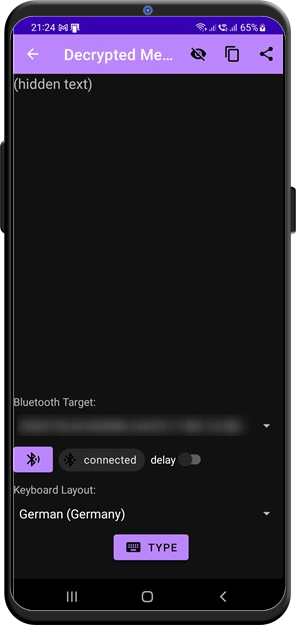

# Decrypted Message

The decrypted message is displayed on this screen. The text is hidden per default, you can make it visible with  if needed. 

You can use [auto-type](autotype.md) and other tools without making the text visible. The comment below the *TYPE* button shows, what piece of information is currently available.

## Other Decrypted Message Plugins: 
- [Crypto Currency Address](./crypto_address.md)