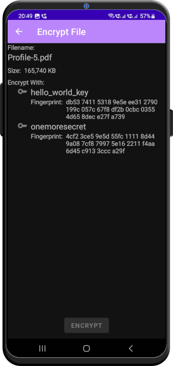

# File Encryption
This is the 1st iteration of the file encryption functionality, we will add more features as time allows.

## What it is for
At times, you will want to store some sensitive information in the cloud. If you don't want Google to snoop around in your files, it is a good idea to encrypt them. It will also protect your data if it is accidentally exposed to a third party. 

## How it Works
You can encrypt single files on your smartphone using *Send To* aka *Share* functionality of your device as follows:
- Locate the file on your smartphone.
- Select *OneMoreSecret* from the *Send To* menu.
- *OneMoreSecret* will open the File Encryption screen as shown below. Select the key you want to use.
- Your file will be encrypted, the result has the same file name with *.oms00* at the end.
- The *Send To* dialog will open again, this time for the resulting file.

## Decryption
If you want to decrypt an *.oms00* file, just send it to *OneMoreSecret* again. It will ask for your fingerprint to access the required key, decrypt the data and bring up the *Send To* dialog for the resulting file. 

## Some technical details
The encryption works exactly the same way the password encryption does. For every file, a unique AES key is generated, which is then encrypted by the RSA key you select in the dialog. The key is stored together with the encrypted data, so every file has all you need to decrypt it again - well, provided you have the right key in your phone. 