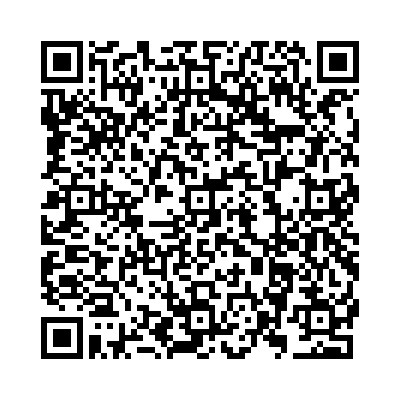

# The Hello World Tutorial

**WARNING**: The images in this tutorial may potentially trigger seizures for people with photosensitive epilepsy. Viewer discretion is advised.

In this tutorial you will get familiar with the core functionality of the oneMoreSecret app. 

## Step 1. Setup biometrics
Please make sure that you have turned on biometrics in your Android device. Go to your phone settings, search for *fingerprint* and set your biometric preferences to fingerprint. 

## Step 2. Install OneMoreSecret app
Get the app from Google PlayStore.

For desktop version, continue with [Step 3](#setp-3-import-private-key). For mobile version, continue with [Step 5](#step-5-mobile-phone-integration).

## Setp 3. Import Private Key
You will generate your own Private Key in omsCompanion. We have prepared a sample key for this tutorial. To import it, please open the app and scan the following QR code sequence: 

The transport password for the key is `we are all mad here`

*DECRYPT* and *SAVE* the key - it will be stored in your phone's key store.

## Step 4. Decrypt the secret message
Now it is time to decrypt a secret message. 

Here it is:

- The app will ask for your fingerprint and decrypt the message. 
- You can reveal the message with the swith on top of the screen.

## Step 5. Mobile Phone Integration.

The mobile integration works in two ways. The first one is a specific link integrated into the HTML page. 

If you are reading this on your smartphone, you can import the private key from above by clicking [here](https://oms-app-intent?oms00_AAAAD2hlbGxvX3dvcmxkX2tleQAQMo5SIV+fmcrTwnSZMGE5jwAQMhZTlDYN6ISV0g9OirxZ+gAAAAABAAQABfD/oZasS3Wgt+Z+M2U6UP8wGP7Le4UuXt4jtHB6+twQNdoLQHyB1RlnIr2Udra3e3iZ80FqzVc00zT1sblpvT7CEmzP5CgzcVZQwSz+0vHT1+BmnvIJVHiGmyzuT62aJJYLtyROGfD9m0wfMQuE1YbichR4tiu5QjCSmNSnNtajd/vkmfM5uIM9mHYu6fyv6QF1UsTHeHaWpDbJ7VjC40K+4doLnnRfNH5zYL/em3Xy0evi/64RITUIsRx1uMoIF4MHpVXu1NU/aJelktWJ5Zmr3jKFvlf32dHqDN+4qcNmwzQQcAurbDDO7ownm0L6SNQHGGhk59rUAD4xg1yJgQMxgCvSFKjr9+Ka6FobflRz+WGdgXR4156U/CHMAjwJv3UJmu+zLKTsWZs1RZ7kkdZme3z9c9IYN4qsYyulCsan1k9/6BFVyJ+qcUUC70Owb7wo9Zj4zbKd9g/yWv0AfIQ8EcW0b1CDSmwYKFmmtPT6wjMuZ5CLbMob/T/GRWGCoWbCZxcXVMGguvwdmHQOiAYWCztWvaZivCz9+pWqcs5GIR/ZLZk3B4yDzyVekwnXwqigs9Ni5J8GHw4m+WwsgIedx3nuLzAZkD5NICDBIjlDDpXctH47pyJhHXpTNvlADhSDJy8gYN2dcYi+u0FLKSp8rTX3aZNfwrf0XEfkPK/3PQnwiZTxp2hXE/rj+SsVP82GQ0tQ3FV1AKzX3Buf+wCK01h0gHOjwYU7gJEIVvQScNrKRWEgzUYCiz11CBeLSMVz3YdLtgBX4K7KTOstZSICsIqW1g+mEcpQh3RccpWZcVsyxNUS/L9ZO5Qzh0xBcJjmc3lQ4oh2vqAXL7ORZLjKzLkqMkMQ8g3uGbOAFovVhunHl6mOM5Q7V213KutBTCV20mRFstWcJKVyZ1909gNplFJdDTz7JJphZ0qfujvYgyTz1Y1ihfAnsw9Q/oFADeX3ekHxYXbD0S++KZZtsyjOtZ3L9v8V1/9k9rkiOf5eTXqBb7AKkP7HFk2n3O7oz3+bjA2s7Fq9W3h/T6hGvHXkHZwdL7fs1EWPk9RzaRGR2riVBETEqGUsPzzVJ80o69puYoLwQkz3z44RGXdsgCYC9BanxDj68n4DZojloQPHKFr8r+UBIDgF3lTJjVV/frpGwVJGT9e+otGfm6opX0VZmdJ4CvsMaWE+FQWr56PaYStL+Y/BpoR78dQl2WQyC/hH6f4H0jTsarMAQgV+KbTdcO3yifpGJr0TsZviPPrA52k4oCsVN5QWDfapX/hg9dsDVAgnahrtrwsPg0VKh/u0y5I4hwKdHPHbg28E5DV38gC6RrMyzB9RjQQFVezdHBd9ovOxyqENqXWgKVBE/kNlND6KwKvJkfwpJcAaMl24AiFK0SRU6Qc9YZWk4eayQe4uCIcJI0mYgt10Ems5Y2yZlwDdaga78tuFgLHO5cthgLp7SpUI/V1TP9pEFe+cVcJykgiAHMqQLgp4kZ8vMiOaf02RY6Sie60SvgGsfDJflhRuHIYKT66TfS8n6ode2cMkhQ1OijY6R9o/Dhi6mx7i9gP/kfRAkkNhVsj0nmmKZq2X1A5PNSJw5jfS1d7xS4ThA7aIUBP8GzGh6mHxBFLMVH8j4JbR2QCmpasUnm3loKeCCPqHdWoFESz5t9aqAIOjuYBGaQpL8jX5hsi6JXDCF3ximGwdu/7MBQRnLfDiwk60e7AFXGb/Tbu2Nu/SjihSu3kH8gm9aymnfLqlNp3lUR+C6wC0M6Fmw/94A64/9Zs3ZUBxOYKLC5BZmPn3X2A0g14VgGcOJE2NCChZkeBvAXx/VGgIr/M2fA2OOt29e5lAnWwe1hSx8PMiKl46/H3Ey8HAPyHp1q3XnTiWCNsvs21WBoFYOQozkIeF+MPFSoU6I/gFStcDCAWAYNQg2iePe5qvl59ukiXJFouMBHJ9Jv+cXr9AkvWPDgsrE2qXQaqQtoeN/89Neo6UQ+O/YCb5rqgUlev1OpkUGIwmHuUfd/zR4w/MTCH3J3eDPVylTQ==).

And [this](https://oms-app-intent?oms00_AAEAAAAg21N0EVMYnl7uMSeQGZwFfGf43ysMvANVTWWN7OJ/pzkAAAAQ87NChX7bQv1P35zZlTBICAEABmwOQYvROKWcWUI32CtAttm9m7EmghJRERlcnjOc8PhArnkGtGYq9M2sS0ZSNnsZuH7w6hD/LcAEUnWRQ34ynGy/jsiv4B4iwA3y0i6cFBmrh2jJEpZxL3gNPRGNfcep6eey22RUNE+CJflf91ttUTJKW3FyKTB9Yed7hqSy5xeYbFuL1h6mWLo3ZHtth+A0HGZXG0V18uwdr/fv7QkmXLT65KOzlv8a5+vjnTKF/S8u9IjC8/D9XixbScB9NuaCFK2Qq0eJ1Hu9bVEFYaGhdgWqhRB/9y6g776ghRkRzXlu8Z/oExVZ9aN5DUg4awGzs0YamMBKP6fkYFXHuyBE6QAgYc2BkuxKjYyNM9EHcai+tE27uS3qKRYoRW1/xpbOPdg=) is the secret message.

Your private password database will be text based though. The text representation of our encrypted message is: 

`oms00_AAEAAAAg21N0EVMYnl7uMSeQGZwFfGf43ysMvANVTWWN7OJ/pzkAAAAQ87NChX7bQv1P35zZlTBICAEABmwOQYvROKWcWUI32CtAttm9m7EmghJRERlcnjOc8PhArnkGtGYq9M2sS0ZSNnsZuH7w6hD/LcAEUnWRQ34ynGy/jsiv4B4iwA3y0i6cFBmrh2jJEpZxL3gNPRGNfcep6eey22RUNE+CJflf91ttUTJKW3FyKTB9Yed7hqSy5xeYbFuL1h6mWLo3ZHtth+A0HGZXG0V18uwdr/fv7QkmXLT65KOzlv8a5+vjnTKF/S8u9IjC8/D9XixbScB9NuaCFK2Qq0eJ1Hu9bVEFYaGhdgWqhRB/9y6g776ghRkRzXlu8Z/oExVZ9aN5DUg4awGzs0YamMBKP6fkYFXHuyBE6QAgYc2BkuxKjYyNM9EHcai+tE27uS3qKRYoRW1/xpbOPdg=`

Just select this text on your phone and send it to OneMoreSecret.

Congratulations, you have successfully decrypted your first message! 🎉

If you now want to delete the test key or create your own, go from the [QR scanner](qr_scanner.md) screen to [Private Keys](key_management.md).
