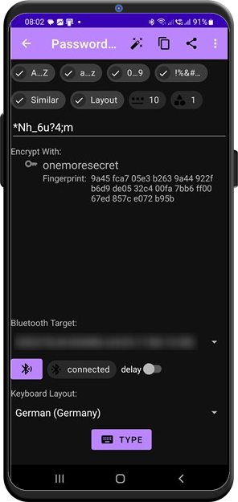

# Password Generator

Here you can generate new passwords based on the profile you define in the upper part of the screen. 
- A...Z - upper-case letters
- a...z - lower-case letters
- 0...9 - digits
- !%&#... - special characters
- Similar - allow characters, that can be easily confused (like *one* and *capital I* or *capital O* and *zero*). 
- Layout - allow only characters that can be typed with the keyboard layout selected in the [auto-type](autotype.md) tool.
- *** - the password length
- the last parameter is minimal occurrence of every character class in the password. In our example, the password will contain *at least one* character of every class. 

You can define character lists behind every character class in the toolbar menu. 

Every time you change the settings or click the *magic wand* button, a new password is generated. Now you can manually edit, copy the **unencrypted** password to the clipboard, send it to another app or [auto-type](autotype.md) it to your desktop PC. 

## Encrypting the password

Selecting one of the available private key entries will encrypt the password. Again, you can copy the encrypted password, send it to another app or [auto-type](autotype.md) it. 

OneMoreSecret does not store your passwords, this password generator is only a helper.