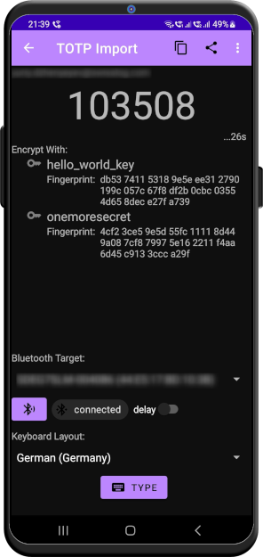

# Time-Based OTP Import
OTP stands for [one-time-password](https://en.wikipedia.org/wiki/Time-based_one-time_password), it is often used in a [multi-factor authentication](https://en.wikipedia.org/wiki/Multi-factor_authentication). 

OTP comes in two flavors: time-based and counter-based, *OneMoreSecret* supports only time-based OTPs.

Once you set up OTP with an online service (say, [Microsoft](https://support.microsoft.com/en-us/office/set-up-your-microsoft-365-sign-in-for-multi-factor-authentication-ace1d096-61e5-449b-a875-58eb3d74de14), [LinkedIn](https://www.linkedin.com/help/linkedin/answer/a1381088/turn-two-step-verification-on-and-off?lang=en) or [GitHub](https://docs.github.com/en/authentication/securing-your-account-with-two-factor-authentication-2fa/configuring-two-factor-authentication)), a barcode with the OTP configuration will be generated and shown to you. Typically, you will scan the bar code using [Google Authenticator](https://play.google.com/store/apps/details?id=com.google.android.apps.authenticator2&hl=de&gl=US) or other security app thus importing the configuration. 

*OneMoreSecret* bar code scanner understands time-based OTP bar codes as well:

Following our philosophy (separation of concerns), *OneMoreSecret* will NOT store your OTP settings though. It will encrypt them with your private key (to do this, select the private key of your choice from the list) turning them into `oms00_...` notation, that you can copy, send to another app or [auto-type](autotype.md). 

You access your OTP configuration in the [same way](./README.md#how-it-works) as your passwords.

